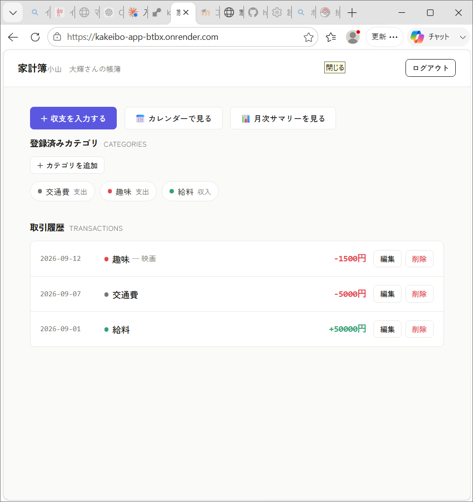
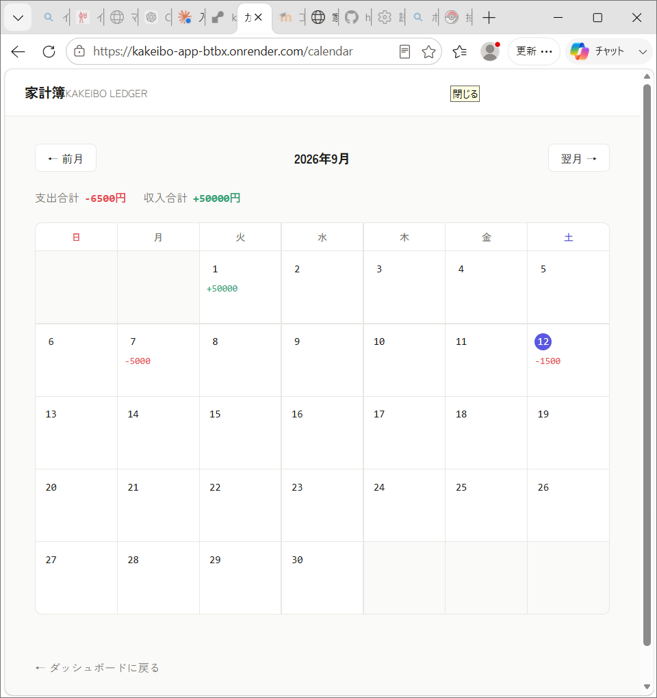
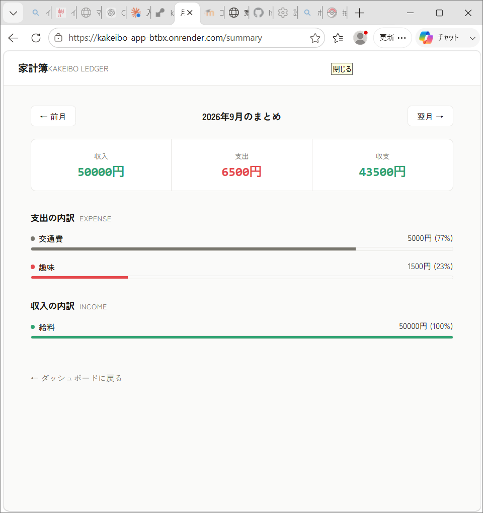
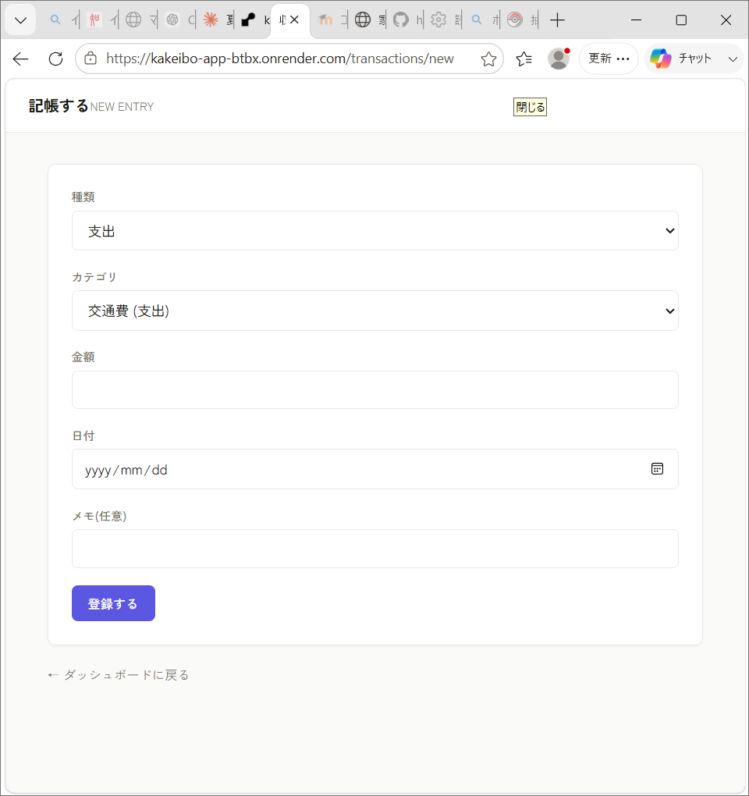

# 家計簿アプリ | Kakeibo Ledger

シンプルで使いやすい個人向け家計簿Webアプリです。日々の収支を記録し、カレンダーとカテゴリ別サマリーで「何にいくら使ったか」を直感的に把握できます。

🔗 **公開URL**: https://kakeibo-app-btbx.onrender.com/
*(※無料プランのため、しばらくアクセスがないと初回表示に時間がかかることがあります)*

---

## 主な機能

- ユーザー登録・ログイン(パスワードはハッシュ化して保存)
- 収支の登録・編集・削除
- カテゴリの作成(デフォルトカテゴリ + 自分専用カテゴリ)
- カレンダー表示(月ごとの日別収支を一覧)
- 月次サマリー(カテゴリ別の内訳をグラフで表示)
- ユーザーごとのデータ分離(他人のデータは見えない設計)

---

## スクリーンショット

| ダッシュボード | カレンダー |
|---|---|
|  |  |

| 月次サマリー | 収支入力 |
|---|---|
|  |  |

---

## 技術スタック

| 分類 | 使用技術 |
|---|---|
| 言語 | Python 3.12 |
| フレームワーク | Flask |
| ORM | SQLAlchemy(Flask-SQLAlchemy) |
| データベース | SQLite |
| 認証 | Flask-Login / Werkzeug(パスワードハッシュ化) |
| フロントエンド | HTML / CSS / Jinja2テンプレート |
| デプロイ | Render(gunicorn) |
| バージョン管理 | Git / GitHub |

---

## 工夫した点

### 1. データベース設計
ユーザー・カテゴリ・取引の3テーブル構成で、カテゴリは `user_id` を`NULL`許容にすることで「全ユーザー共通のデフォルトカテゴリ」と「ユーザー独自のカテゴリ」を同じテーブルで管理できるようにしました。これにより、初回登録時から最低限のカテゴリが使える状態を保ちつつ、ユーザーごとのカスタマイズにも対応しています。

### 2. セキュリティ
- パスワードは平文で保存せず、`werkzeug.security` でハッシュ化
- 取引の編集・削除時に `current_user.id` とデータの所有者を照合し、他人のデータを操作できないようにアクセス制御を実装

### 3. データの可視化
カレンダー表示では日付ごとに支出・収入を集計し、月次サマリーではカテゴリ別の内訳をバーグラフで表示。単なるCRUDで終わらせず、「記録したデータをどう見せるか」に力を入れました。

### 4. UI/UXデザイン
Notion / Linear を参考に、余白を活かしたミニマルなデザインに調整。金額表示には等幅フォントを使い、桁が揃って見やすくなるようにしています。

---

## 今後の改善案

- カテゴリごとの月間予算設定とアラート機能
- レシート画像からのOCR自動入力
- CSVエクスポート機能
- グラフの種類を増やす(前月比較など)

---

## ローカルでの実行方法

```bash
git clone https://github.com/haruki-koyama7/kakeibo-app.git
cd kakeibo-app
python -m venv venv
venv\Scripts\Activate.ps1  # Windows
pip install -r requirements.txt
python app.py
python init_db.py  # 初回のみ、デフォルトカテゴリと仮ユーザーを作成
```

`http://127.0.0.1:5000` にアクセスしてください。

---

## ディレクトリ構成

```
kakeibo-app/
├── app.py              # ルーティング・アプリ本体
├── models.py            # DBのテーブル定義
├── config.py             # 設定ファイル
├── init_db.py             # 初期データ投入用スクリプト
├── templates/              # HTMLテンプレート
├── static/css/style.css     # スタイル
└── requirements.txt          # 依存ライブラリ一覧
```